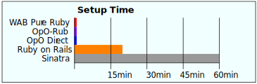
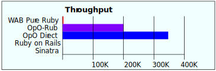

# WABuR (Web Application Builder using Ruby)

[](http://travis-ci.org/ohler55/wabur?branch=develop)
[](https://ci.appveyor.com/project/ohler55/wabur/branch/develop)
[](https://rubygems.org/gems/wabur)
[](https://rubygems.org/gems/wabur)

WABuR is a Web Application Builder using Ruby. It is easy to use, taking just
a minute to create a `Hello World` web application and it is _FAST_, hitting
over 200,000 fetches a second with a Ruby core! It employs a modern NoSQL JSON
data store and a single-page UI using JavaScript.

It is pluggable and extendable in many ways to allow new additions,
alternative databases, and any number of UIs.

## Quick Start

With WABuR you are up and running in minutes with only one file to modify to
specify attributes. It doesn't get any simpler. Heres how.

Install the wabur gem.

```
$ gem install wabur
```

Create a new project and `cd` into the directory.

```
$ wabur new --base blog Entry
$ cd blog
```

Define attributes for the data elements along with the attributes that will be
displayed in a list view. Open `lib/ui_controller.rb` and modify by adding two
lines and changing one.

```ruby
require 'wab/ui'

class UIController < WAB::UI::MultiFlow

  def initialize(shell)
    super
    add_flow(WAB::UI::RestFlow.new(shell,
                                   {
                                     kind: 'Entry',
                                     title: '',
                                     content: "\n\n\n\n",
                                   }, ['$ref', 'title']))
  end
end
```

Just run the `wabur` command from inside the project directory. Open
`localhost:6363` in a browser.

```
$ wabur
```

Want to know more? A tutorial is available in the [tutorial](tutorial/README.md)
directory. It takes a couple of minutes to go through the first lesson.

## Fast Benchmarks


<table>
<tr><td></td><td></td></tr>
</table>

| Runner        | Read Throughput | Read Latency | Create Throughput | Create Latency | Setup time |
| ------------- | --------------- | ------------ | ----------------- | -------------- | ---------- |
| WAB Pure Ruby | 2.8K Reads/sec  | 1.4 msecs    | 2.2K Creates/sec  | 1.8 msecs      |  1 minute  |
| OpO-Rub       | 212K Reads/sec  | 0.09 msecs   | 134K Creates/sec  | 0.15 msecs     |  1 minute  |
| OpO Direct    | 364K Reads/sec  | 0.05 msecs   | 157K Creates/sec  | 0.13 msecs     |  1 minute  |
| Ruby on Rails |  123 Reads/sec  | 175 msecs    | ---- Creates/sec  | ---- msecs     | 20 minutes |
| Sinatra       | 1.5K Reads/sec  |  13 msecs    | ---- Creates/sec  | ---- msecs     | 60 minutes |

More interested in the benchmarks? Then take a look at the [benchmarks page](benchmarks/README.md).

## Where to use WABuR

WABuR takes a different approach which opens up new possibilities for uses of
Ruby. Some examples that WABuR is suitable for are:

 * Race Results - With the ability to handle massive traffic WABuR can keep up
   with the load imposed by hundreds of thousands of users requesting results
   during the race and with the ability to have multiple UIs realtime displays
   can be different than those used to display results after the race.

 * Voting Systems - Voting systems collect and forward results to central
   servers. Loads are high during peak periods but well within the limits that
   WABuR is able to handle. The ease extending WABuR makes it easy to
   implement the migration of data to a central server or multiple servers.

 * Operations Monitoring - Log using JSON and WABuR can be used to monitor and
   query logs.

 * Market Data - With the high throughput and low latency WABuR is a good
   candidate for systems that need to display market data and processing of
   market data.

 * Mapping - Systems that display data on a map can use WABuRs flexibility
   with regard to the UI.

 * Directory - As an example of a quick and easy build, an directory or
   address book can be started in minutes.

## Rails

A natural question is *"What about Rails?"*. Rails is well established and has
a huge user base. WABuR is not a replacement for Rails. It is an alternative
for those who want to explore using JSON databases with a single-page dynamic
JavaScript UI.

## Participate and Contribute

If you like the idea and want to help out, or become a core developer on the
project, send me an [email](mailto:peter@ohler.com). Get in on the ground floor
and lets make something awesome together.

### Guidelines

These are the simple guidelines for contributing.

1. Take a look at the [architecture page](pages/Architecture.md) and the source code.

2. Coordinate with me first before getting started to avoid duplication of
   effort or implementing something in conflict with the plans.

3. Branch off the `develop` branch and submit a PR.

4. Write unit tests.

5. Write straight forward, clean, and simple code. No magic stuff, no monkey
   patching Ruby core classes, and no inheriting from core classes.

## References and Links

 - [Oj](https://github.com/ohler55/oj) JSON parser used in WABuR.
 - [OpO](http://opo.technology) home of the Opo-Rub runner.
 - [Sass](http://sass-lang.com) used to build the reference implementation UI CSS.
 - [SystemJS Babel Plugin](https://github.com/systemjs/plugin-babel) also used to transpile JavaScript.
 - [SystemJS](https://github.com/systemjs/systemjs) used to convert JavaScript ES6 to ES5 in the browser.