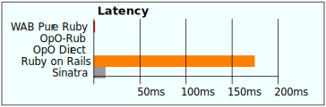

# WABuR Benchmarks




| Runner        | Read Throughput | Read Latency | Create Throughput | Create Latency | Setup time |
| ------------- | --------------- | ------------ | ----------------- | -------------- | ---------- |
| WAB Pure Ruby | 2.8K Reads/sec  | 1.4 msecs    | 2.2K Creates/sec  | 1.8 msecs      |  1 minute  |
| OpO-Rub       | 212K Reads/sec  | 0.09 msecs   | 134K Creates/sec  | 0.15 msecs     |  1 minute  |
| OpO Direct    | 364K Reads/sec  | 0.05 msecs   | 157K Creates/sec  | 0.13 msecs     |  1 minute  |
| Ruby on Rails |  123 Reads/sec  | 175 msecs    | ---- Creates/sec  | ---- msecs     | 20 minutes |
| Sinatra       | 1.5K Reads/sec  |  13 msecs    | ---- Creates/sec  | ---- msecs     | 60 minutes |

At more than 300K fetches per second the direct access is clearly the fastest
of the bunch but it bypasses the Ruby controller. OpO-Rub with embedded Ruby
gives results that surpass the other option by a sizeable amount. Noting the
setup time, WABuR was much simplier to setup.

## Details

The benchmarks compare two different WABuR runners along with a Ruby on Rails
sample and a Sinatra sample. An OpO direct comparison is also given for
comparisone although it is a direct database access without Ruby code being
invoked. For all the runs at least the read operations were run. Setup times
are estimates and based on how long someone with Ruby knowledge only would
need to finish a tutorial available online.

Benchmarks were run on a desktop with an 4.00GHz i7-6700 with 4 cores (8
hyperthreads.

The benchmark driver is a special purpose tool included in the OpO
distribution. Using the OpO-Rub Runner, a Ruby HTTP client is not able to
generate requests and process responses quick enough to reach the limits of
the Runner. Instead a C based HTTP benchmarking tool is used. It is in the OpO
download and is called **`hose`**. Tests were run with connections in
'keep-alive' mode unless results were better or the same with a new connection
each time.

### WAB Pure Ruby

The wabur gem includes an app called `wabur` that is a pure Ruby runner. The
wabur gem tutorial was used for this benchmark application.

The 'create' run starts with a clean or empty data directory.
```
> bin/hose -t 1 -c 4 -p v1/Entry -r put.txt localhost:6363
localhost:6363 processed 2154 requests in 1.000 seconds for a rate of 2154 Requests/sec.
with an average latency of 1.841 msecs
```

The 'read' run uses the data created with the 'create' run.
```
> bin/hose -t 1 -c 4 -p v1/Entry/23 localhost:6363
localhost:6363 processed 2812 requests in 1.000 seconds for a rate of 2812 Requests/sec.
with an average latency of 1.407 msecs
```

### Opo-Rub

Using the same wabur application files the `opo-rub` application was used to
run the application.

The 'create' run starts with a clean or empty data directory.
```
> bin/hose -t 2 -c 10 -p v1/Entry -r put.txt -k localhost:6363
localhost:6363 processed 133665 requests in 1.000 seconds for a rate of 133665 Requests/sec.
with an average latency of 0.146 msecs
```

The 'read' run uses the data created with the 'create' run.
```
> ../../wush/bin/hose -t 2 -c 10 -k -p v1/Entry/267 localhost:6363
localhost:6363 processed 212318 requests in 1.000 seconds for a rate of 212318 Requests/sec.
with an average latency of 0.092 msecs

```

### OpO Direct

OpO allows direct access to the database unless configured to not allow
access. Those APIs were used for these runs.

The 'create' run starts with a clean or empty data directory.
```
> bin/hose -t 2 -c 10 -p json -r jput.txt -k localhost:6363
localhost:6363 processed 157067 requests in 1.000 seconds for a rate of 157067 Requests/sec.
with an average latency of 0.125 msecs
```

The 'read' run uses the data created with the 'create' run.
```
> ../../wush/bin/hose -t 2 -c 10 -k -p json/000000000000000b localhost:6363
localhost:6363 processed 364762 requests in 1.000 seconds for a rate of 364762 Requests/sec.
with an average latency of 0.052 msecs
```

### Ruby on Rails

The rails 5.1.4 benchmark example for Ruby on Rails was made following the
tutorial at
[http://guides.rubyonrails.org/getting_started.html](http://guides.rubyonrails.org/getting_started.html). After
going throught the lesson once a second pass was made following the outlined
steps. The tutorial was still used as a reference but only for key parts to
reduce the time in creating the project. It still took 20 minutes to create
the project.

Benchmarking creates was not attempted as Rails expects object to be created
via a web browser. Not something that lends itself well to benchmarking.

The run for a read operations is:

```
> bin/hose -t 2 -c 10 -p articles/1 localhost:3000
localhost:3000 processed 123 requests in 1.000 seconds for a rate of 123 Requests/sec.
with an average latency of 174.816 msecs
```

### Sinatra

The guide at
[http://guides.railsgirls.com/sinatra-app](http://guides.railsgirls.com/sinatra-app)
was used to create the Sinatra benchmark application. This is not really a
fair example as it creates a tally page instead of saving individual
entries. As a guess it would take at least an hour to create a reasonable
comparison with create and read capabilities. Sinatra is really just a router
with support for page generation with ERB. Any data storage has to be done
separately. Just read operations are shown.

```
> bin/hose -t 2 -c 10 -p results localhost:4567
localhost:4567 processed 1539 requests in 1.000 seconds for a rate of 1539 Requests/sec.
with an average latency of 12.980 msecs
```
