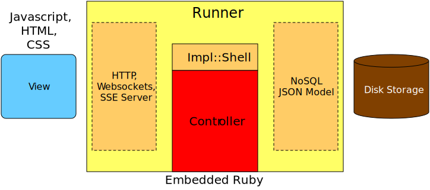

# Architecture

The architecture provides many options but keeps a clean and clear API between
modules. This pluggable design allows for unit test drivers and various levels
of deployment options from straight Ruby to a high performance C runner that
handles HTTP and data storage.

Three configuration are available. One uses a Runner that calls to the Ruby
core controller through pipes on ```$stdin``` and ```$stdout```. A second is
to implement a runner in Ruby (bin/wabur). The third is to use a C Runner with
embedded Ruby (OpO-Rub).

The WAB architecture is a Mode View Controller with clear APIs between each
part of the MVC. The design allows the non-business related tasks such as the
HTTP server and data store to be treated as service to the Controller which
contains the business logic.

A Runner that spawns (forks) and runs a Ruby Controller makes use of the
```::WAB::IO::Shell```.


The Ruby Runner and C Runner with embedded ruby follow the same architecture.



Access to data can follow two paths. A direct access to the data is possible
as portrayed by the red line that flows from HTTP server to the runner and
onto the Model. The other path is to dive down into the Ruby Controller and
allow the Controller to modify and control what is returned by a request. The
Benchmark results in the example/sample/README.md includes the latest results.


Simplified the logical view is:


## MVC

The Model View Controller pattern is a well known and widely accepted design
pattern. It is also the pattern used by Rails. WAB adheres to this model with
well defined APIs that are used exclusively.

The MVC pattern has many variants with some functionality being in different
components depending on how the lines are drawn between those components. No
matter what the separation, if it is clear many issues can be avoided.

### Model

The Model component is responsible for persisting data, providing search and
retrieval capabilities, and assuring stored consistency. The Model does not
assure business logic consistency nor does it enforce relationships between
data elements. It is a data store only.

The data in the system is follows a JSON structural model. This make a NoSQL
database an ideal store. It does mean that the Model data is unstructured in
that there is no schema enforced by the data store. It does not mean that
relationships do not exist in the data store.

With well defined APIs between the Model and the Controller almost any data
store can be used as long as an adapter is written. This allows options such
as [MongoDB](https://www.mongodb.com), [Redis](https://redislabs.com),
[OpO](http://opo.technology), a file based store, or even an in memory store
for testing.

One feature that may not be supported by all stores is the ability to push
changes from the data store to the Controller and then up to the View to real
time feeds.

### View

An HTTP server provides the View environment. In addition to serving HTML,
CSS, images, and other files typically served by a web server the View server
also supports exchanging JSON data through a REST API. A WebSocket and SSE
capability is also expected and designed for in the API.

Javascript is the suggested language to use for web pages but any approach to
accepting and delivering JSON is fine. JaveScript helpers are provided that
support the REST API as well as the WebSocket and SSE push APIs.

### Controller

With two approaches to connecting the Controller to the View and Model there
are deployment options that allow trading off latency for throughput. The
Controller code is isolated from those deployment choices except for the
choice of language. If the Controller is written in Ruby then it can be either
embedded in the shell or access as an external application.

The Controller is a bridge between the View and Model and implements the
business logic as needed. In the case of a fetch, create, or update options
are available to bypass or use the default Controller. The bypass allows a
more direct conduit between the View and the Model with the Controller just
passing the data along to the model and vice versa.

The Controller can also receive callbacks on changes in the Model which can
then be forwarded to the View if a subscription to that data has been made.

## APIs

All APIs are described with Ruby code as the Controller is expected to be
Ruby. If an external Controller is to be used then the external glue API is
used. This API is a text based API over a pipe (Unix socket). Events can
arrive at the Controller from either the View or Model interface.

### Data Model

Data is loosely represented as JSON. There are some expectations that can be
relaxed if desired.

#### JSON

The data exchanged between components follows the JSON model for primitives
with a few optional additions. The JSON types can be used exclusively and are:

 - `null` (nil)
 - _boolean_ (`true` | `false`)
 - _string_ (String)
 - _number_ (Integer | Float | BigDecimal)
 - _object_ (Hash)
 - _array_ (Array)

All string must be UTF-8 or Unicode.

Some other types are also allowed. Each has a defined JSON representation that
can be used instead.

 - _time_ (Ruby Time encoded in RFC 3339 format if a string)
 - _UUID_ (WAB::UUID encoded as defined by RFC 4122)
 - _IRI_ (WAB::IRI encoded as defined by RFC 3987)

These types are represented by the WAB::Data class.

#### Structure

While object can be any JSON or WAB::Data they are encouraged to be JSON
Objects (Hash) types. I addition one attribute should be used to identify the
type. The default is the 'kind' attribute. That attribute is not required to
be the 'kind' attribute but can be anywhere in the data tree as long as it is
consistent across all types. As an example it could be in 'meta.kind' where
that key represents a path with a 'kind' element in a 'meta' object (Hash).

Each object or for that matter every node in a Data tree is assigned a system
wide unique identifier. That is used to identfiy each object when using the
API. From the view perspective a REST over HTTP is used.

#### Just Data

  - just data and data helpers (get, set, inspect, to_s)
   - nothing like to_json
   - reasoning it that different uses require different behavior
    - different stores, view, processing, etc
   - use of delgate is encouraged


### View/Controller

The View/Controller API is predominanty from View to Controller but the
ability for the Controller to push data to the View is also part of the
design. That allows pages to take advantage of WebSockets or SSEs to display
data changes as they occur.

See the Controller class documentation for further details.

### Controller/Model

The Contoller/Model API is driven mostly from Controller to Model with the
Model responding to queries. Like the View/Controller API the Model can also
push changes to the Controller.

The Model supports basic CRUD operations as well as a query API that uses
[TQL](http://opo.technology/pages/doc/tql/index.html) in both the friendly and
JSON formats. Support for GraphQL is anticipated but not for the first
iteration.

See the Model class documentation for further details.

## Shells

As noted in the architecture diagram, the WAB Shell can be either the C or
Ruby shell. The Ruby shell is intended for development and possibly small
installations. The C WAB Shell or Shells if more thna one is implemented are
intended to be high performance environments that the Controller code resides
in either as embedded code or through a piped connections.

### Embedded

A C WAB Shell with an embedded Controller utilizes the View and Model APIs
directly through the Ruby library. This approach gives more control to the
Shell in regard to utilizing threads and C libraries outside of Ruby. An
alternative approach is to call C extensions from Ruby but that approach is
left for future if it makes sense.

The Ruby WAB Shell implements an HTTP server as well as either an in memory
data store or a file based data store.

The APIs are designed to allow relatively direct modifications to the data
store if the store supports such.

The embedded Shell should have the lowest latency but may sacrifice throughput
depending on the complexity of the Controller code.

### External

Running external Controllers is implemented by the WAB Shell either spawning
the Controller application or connecting to an existing one. Multiple
Controllers can be active to allow parallel Controller processing. The
approach taken is the same as that used [Piper Push
Cache](http://piperpushcache.com) with the process flow [Spawn
Actor](http://piperpushcache.com/help_actor_spawn).

To run a Controller written in Ruby the External Glue is used to bridge the
gap between the WAB external API and the Controller APIs. This is a light
weught layer that converts to and from the text based pipe API and the Ruby
APIs.

With the ability to make use of multiple Controller instances which may reside
on different machines the throughput is expected to be higher than the
embedded Shell but with a degradation of the latency.

### Alternatives

A straight Ruby WAB Shell is the choice for testing and for small
installations. The Ruby shell is the first choice when getting started.

Outside of this project WAB C or other language shells can be written. The
first is expected to be a derivative of [OpO](http://opo.technology) as it
takes shape. This WAB Shell will also draw on the libraries use by [Piper
Push Cache](http://piperpushcache.com) to provide WebSocket and SSE support.
