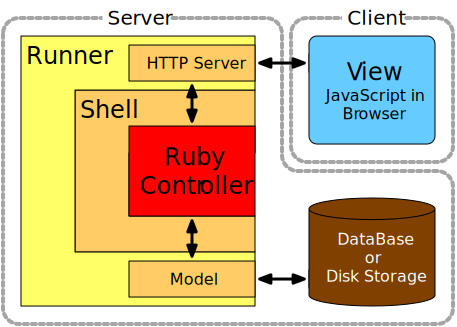

# WABuR Tutorial Lesson 1

This first lesson of the WABuR Tutorial covers.

 - [Application Design](#application-design)
 - [WABuR Components and Terminology](#wabur-components-and-terminology)
 - [Development Environment](#development-environment)
 - [File and Directory Organization](#file-and-directory-organization)
 - [Implementation](#implementation)
 - [Running](#running)
 - [Index.html](#index-html)

## Application Design

The first step in building any application is deciding what to build. WABuR or
simply WAB will follow an object based design. With that in mind, building a
blog will require blog entries so an Entry will be the primary object-type in
the application.

An Entry will initially have two attributes, a **title** and
**content**. Later more attributes will be added but initially, those two
attributes will be sufficient. The canonical data representation is JSON so in
this tutorial JSON will be used to describe objects and data.

For the blog a list of Entries is desired. Additionally, the standard CRUD
operations of Create, Read, Update, and Delete will be desired in the displays
as well as the rest of the application implementation. The reference
implementation for WABuR is to follow a REST model that provides the data
access.

## WABuR Components and Terminology

WABuR is designed as a Model View Controller (MVC) system. At the core is a
Ruby Controller that executes the business logic of the app. The Controller
resides at the server-side. To support the Controller, an HTTP web server and
a Database are needed. This is provided by the Runner-Shell combination as
denoted in the WAB Components diagram. The view aspect of the MVC pattern here
is a JavaScript implementation at the client-side in a browser. JavaScript
essentially implements a separate display application that interacts with the
Controller with messages that are exchanged via the HTTP server conforming to
a defined API.

The WAB architecture allows for replacement of multiple parts of the system
without changing the code of other parts. For example, the View component
could be replaced by a completely different custom JavaScript
implementation. A CLI could even be implemented to interact with the
Controller through a Runner with no changes to the server-side. Multiple View
implementation could even be run at the same time. Additionally, as will be
seen in later lessons, the Runner and Shell can be swapped out for
alternatives that are have higher performance characteristics and use a
different storage mechanism. The Runner and Shell form the server side of the
application while HTML, CSS, and JavaScript form the client side. Since the
server does provide the files to the client there is some breakdown in the
separation but Ruby files devoted to the View or UI are strictly for
generating the HTML and Javascript for the UI.



The design pattern used for the WABuR reference implementation utilizes a REST
based API. This matches well with the object-based approach to the design and
to storage of data, not as tables, rows, and columns but as JSON records which
encapsulate the data of the objects being stored. A REST API encourages the
use of an object based set of displays so in the reference WABuR View
implemenation each display is backed by either a single object or in the case
of lists a set of objects.

The use of the term 'display' is similar to what many might think of as a page
on a web site. Page is not exactly correct for the View though as the View is
implemented as a single page that frames a display area. That display area is
where the JavaScript code displays the content of each psuedo page which is
referred to a a display in this tutorial.

On the modeling side, storing any JSON record is possible but not very helpful
when using a class based API. To resolve this issue the reference
implemenation enforces the addition of an object class stored in the JSON
records in the 'kind' field. That can be changed but the default is 'kind'. As
an example, for an Entry with a title and content attribute the JSON stored
would look like:

```javascript
{
  "kind": "Entry",
  "title": "First Entry",
  "content": "Just saying hello!"
}
```

Other than in the View there is no need to know what the JSON looks like but
it is a convenient way to describe the structure of the object.


When a request is made from the browser the typical flow is of course from the
client browser to the server. Digging a bit deeper we see that a request (1)
goes through the HTTP server in the Runner through the Shell where it is
converted to one of the CRUD methods on the Controller. The Controller then
makes one or more calls to the Model (2) to retrieve or otherwise modify data
in the Model database. The Model responds accordingly with the results of a
fetch or query (3). The Controller then responds to the HTTP request through
the Shell and Runner (4).

## Development Environment

For development the pure Ruby Runner and Shell are used. The pure Ruby Runner
is in the `bin` directory and is named `wabur`. A browser will also be needed
to test the View or UI. Rounding out the environment would be a test directory
for writing unit tests. The WABuR design makes it easy to write unit tests on
the Controller. The Controller interface is limited and well defined. Moving
up from testing the Controller by itself the Controller inside a Runner can be
tested using 'curl' which makes testing the server side possible in a
continuous integration suite. For this lesson only a UI Ruby file will be
needed along with a simple HTML index file.

## File and Directory Organization

The files for this lesson are in the `lesson-1/app` directory. The directory
is laid out as indicated in sub-directories.

```
blog
├── config
|   ├── wabur.conf
|   ├── opo.conf
|   └── opo-rub.conf
├── lib
|   └── ui_controller.rb
└── site
    ├── assets
    |   ├── css
    |   |   └── wab.css
    |   ├── fonts
    |   |   └── wabfont
    |   |       ...
    |   └── js
    |       ├── wab.js
    |       └── ui.js
    └── index.html
```

The `lib` sub-directory is for Ruby code that implements the UI configuration
as well as the Controllers. In lesson-1 the `WAB::OpenController` is used so
there is no need for any Controller customization. In later lessons
Controllers will be added.

Content that is served to the clients in response to HTTP page requests is in
the `site` sub-directory. For lesson-1 there is no site directory and the
wabur defaults will be used.

The `config` directory includes configuration files for the Runners.

The `js` directory is for JavaScript files. The WABuR reference implementaion
name, **ui** uses ECMAScript2015 (ES6). For browsers that do not support ES6
SystemJS is used. Both ES6 and ES5 files can be included in the `js`
directory. If a mix is used then the ES6 files should have a `.es6` suffix to
avoid confusion. Runners are setup to identify that extension as an
`application/json` mime type.

## Implementation

At the core of the system is the Controller. The Controller is a bridge
between the View and Model. It presents a business object perspective to the
View component and maps business object to the Model storage objects.

The Model provides access to stored data. In WABuR the Model is accessible to
the Controller through the Shell. The stored data is JSON and can be data
stored from other applications or data managed only by the Model.

The View runs in the client or in the normal case, a browser. The WABuR
reference implemenation provides HTML and JavaScript using Ruby code as well
as JavaScript libraries.

Generally a Controller Ruby file as well as a view or UI files are present but
for the objects that follow a simple REST pattern the `WAB::UI::RestFlow`
provides the default REST flow patterns. To see what that configuration looks
like either wait for later lessons or set up a test and print out the output.

All files necessary are generated by creating a project directory or creating
a project in GitHub and cloning it. Then `cd` to the project
directory. Assuming the project was called `blog` execute the following
commands.

```
$ mkdir blog
$ cd blog
$ wabur init Entry
```

This will generate all the files needed to run but since the Entry type has
not been defined it will be a rather boring display.

To start from scratch, locally, use `wabur new` mode. Simply run the following
to create a project directory at './blog' and initialize controllers for type
Entry:

```
$ wabur new --base blog Entry
```

To define the Entry type the `lib/ui_controller.rb` is edited. Two attributes
will be added, 'title' and 'content'. After opening the file notice the
creation of a RestFlow where the second argument is a template for the Entry
type. The only attribte is the kind of record an Entry is. Of course the value
is 'Entry'.

```ruby
# encoding: UTF-8

require 'wab/ui'

class UIController < WAB::UI::MultiFlow

  def initialize(shell)
    super
    
    add_flow(WAB::UI::RestFlow.new(shell,
                                   {
                                     kind: 'Entry',
                                   }, ['$ref']))
  end

end # UIController
```

Go ahead and add the title and content to the template. The values are the
default values for the attribute. Notice the 'content' as four newlines in the
content. This is an indication that the display item should be a TEXTAREA with
four lines,

The third argument to the RestFlow initializer is a list of attribute paths
will be displayed in a list view.

```ruby
    add_flow(WAB::UI::RestFlow.new(shell,
                                   {
                                     kind: 'Entry',
                                     title: '',
                                     content: "\n\n\n\n",
                                   }, ['title', 'content']))
```

The generated configuration implements a UI flow as illustrated. Note the
boxes in the diagram represents displays and the links between then represent
transitions from one display to another triggered by an action such as
pressing a button.


Each member of the template is an attribute of the business object managed by
the Controller and used for presentation in the displays. The 'kind' attribute
identifies the kind or class of the object. Other attributes help identify
which type the attribute should. An integer indicates an integer number is
expected. A string is text and a string with multiple newline characters
indicates a textarea should be used with the number of line identified by the
number of newlines. The values also act as the default values for the
attribute.

If this is a Git project then a `.gitignore` should ignore the data and log
directories which will be in 'opo` and 'wabur' depending on the runner used.

## Running

The `wabur` Runner is used for this lesson. To start the Runner, the wabur gem
must be installed or the wabur source must be available. Assuming the gem is
installed and the run location is in the `blog` directory the command
to run the application is:

```
$ wabur
```

That will start the Runner listening on port 6363 and storing data in the
`wabur/data` directory. Open a browser and type in `http://localhost:6363` and
observe an empty blog entry list. Use the `Create` button to create a new Entry
and the other displays and buttons to experience the new application.

This command uses command line options to over-ride the defaults but a more
common approach is to set up a configuration file that identifes the Runner
options. Using the configuration file allows multiple Controllers to be mapped
to different URL paths or routes.

## Index.html

Since this is your blog a more customized front page is probably preferred. So
far there is no `site` directory or an `index.html` file. Those files are
virtual, by default. In other words, they're accessed from within the `wabur`
gem itself.

To customize these files easily, they can be generated at the current WAB
workspace by running the `wabur init` command with a `--site` option.

```
$ wabur init --site
```

> Pro-tip: Alternatively, the `--site` option can be passed to `wabur new` as
well, to generate these files alongwith the config files and UI Controller.

The `index.html` should now be present as `site/index.html`. Make some
modifications and try running `wabur` again and the new files will be
used. The CSS files and the JavaScript can also be modified.

There are a few things that should be present in the `index.html` file. For
this lesson the wab CSS is used so a link in the head is needed to pick those
up. A `div` element with an `id` of `view` is also needed so the wab
JavaScript knows where to build displays. Finally a `script` tag is needed to
pull in the wab UI JavaScript.

```html
<!DOCTYPE html>
<html>
  <head>
    <meta charset="UTF-8" />
    <title>Welcome to My Blog</title>
    <link rel="stylesheet" type="text/css" media="screen, print" href="assets/css/wab.css" />
    <link rel="stylesheet" type="text/css" media="screen, print" href="assets/fonts/wabfont/style.css" />
  </head>
  <body>
    <header class="header">
      <div class="logo">
        <span class="brand">My Blog</span>
      </div>
    </header>

    <main class="content">
      <div id="view" class="view-content">
      <!-- contents -->
      </div>
    </main>

    <footer class="footer">
      <div class="attribution">
        Powered by <a class="brand" href="https://github.com/ohler55/wabur">WABuR</a>
      </div>
    </footer>

    <script src="assets/js/ui.js" type="module"></script>

    <script nomodule src="assets/js/systemjs/system.js"></script>
    <script nomodule src="assets/js/transpile.js"></script>

  </body>
</html>

```

Now when wabur is run the frame identifies the page as your blog.
