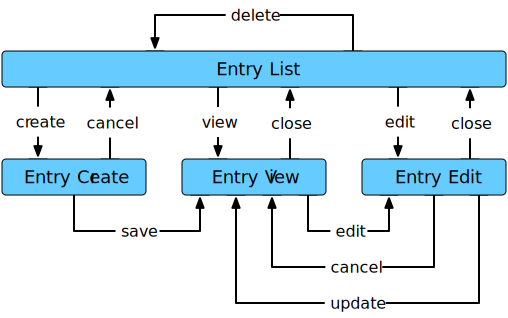

# WABuR Tutorial Lesson 1

This first lesson of the WABuR Tutorial covers.

 - [Application Design](#application-design)
 - [WABuR Components and Terminology](#wabur-components-and-terminology)
 - [Development Environment](#development-environment)
 - [File and Directory Organization](#file-and-directory-organization)
 - [Implementation](#implementation)
 - [Running](#running)

## Application Design

The first step in building any application is deciding what to build. WABuR or
simply WAB will follow an object based design. With that in mind, building a
blog will require blog entries so an Entry will be the primary object-type in
the application.

[tell me more...](MORE.md#application-design)

## WABuR Components and Terminology

WABuR is designed as a Model View Controller (MVC) system. At the core is a
Ruby Controller that executes the business logic of the app. The Controller
resides at the server-side. To support the Controller, an HTTP web server and
a Database are needed. This is provided by the Runner-Shell combination as
denoted in the WAB Components diagram. The view aspect of the MVC pattern here
is a JavaScript implementation at the client-side in a browser.  JavaScript
essentially implements a separate display application that interacts with the
Controller with messages that are exchanged via the HTTP server conforming to
a defined API.

[tell me more...](MORE.md#wabur-components-and-terminology)

## Development Environment

For development the pure Ruby Runner and Shell are used. The pure Ruby Runner
is in the `bin` directory and is named `wabur`. A browser will also be needed
to test the View or UI.

[tell me more...](MORE.md#development-environment)

## File and Directory Organization

The files for this lesson are in the `lesson-1/app` directory. The directory
is laid out as indicated in sub-directories.

```
app
├── lib
|   └── ui
|       └── entry.rb
└── pages
    └── index.html
```

[tell me more...](MORE.md#file-and-directory-organization)

## Implementation

At the core of the system is the Controller. The Controller is a bridge
between the View and Model. It presents a business object perspective to the
View component and maps business object to the Model storage objects.

The Model provides access to stored data. In WABuR the Model is accessible to
the Controller through the Shell. The stored data is JSON and can be data
stored from other applications or data managed only by the Model.

The View runs in the client or in the normal case, a browser. The WABuR
reference implemenation provides HTML and JavaScript using Ruby code as well
as JavaScript libraries.

Two files are needed for this lesson. A Ruby file for the UI and an HTML index
file.

[tell me more...](MORE.md#implementation)

### entry.rb

The `entry.rb` file generates configuration for the `wab` JavaScript
library. It also provides the HTML templates to be used for the display.

```ruby
require 'wab/ui'

class Entry < WAB::UI::RestFlow

  def initialize()
    template = {
      kind: 'Entry',
      title: '',
      content: '\n\n\n\n',
    }
    super(template)
  end

end # Entry

```

The generated configuration implements a UI flow as illustrated. Note the
boxes in the diagram represents displays and the links between then represent
transitions from one display to another triggered by an action such as
pressing a button.



[tell me more...](MORE.md#entry.rb)

### index.html

The `index.html` file provides the frame around the display area that will be
used for the dynamic portion of the application.

```html
<!DOCTYPE html>
<html>
  <head>
    <meta charset="UTF-8" />
    <title>Welcome to WABuR Tutorial Lesson One</title>
    <link rel="stylesheet" type="text/css" media="screen, print" href="http://www.wab.systems/ref/latest/assets/css/wab.css" />
    <link rel="stylesheet" type="text/css" media="screen, print" href="http://www.wab.systems/ref/latest/assets/wabfont/style.css" />
  </head>
  <body>
    <main class="content">
      <div id="view" class="view-content">
      </div>
    </main>

    <script src="http://www.wab.systems/ref/v0.7.0/assets/js/wab.js"></script>
  </body>
</html>
```

[tell me more...](MORE.md#index.html)

## Running

The `wabur` Runner is used for this lesson. To start the Runner, the wabur gem
must be installed or the wabur source must be available. Assuming the gem is
installed and the run location is in the `lesson-1` directory the command to
run the application is:

```
> wabur -I app/lib --base app --controller WAB::OpenController --ui UI::Entry 
```

That will start the Runner listening on port 6363 and storing data in the
`app/data/wabur` directory. Open a browser and type in `http://localhost:6363` and
observe an empty blog entry list. Use the `Create` button to create a new Entry
and the other displays and buttons to experience the new application.

[tell me more...](MORE.md#running)
