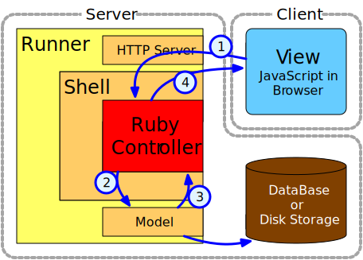

# WABuR Tutorial Lesson 2

Logging is discussed in this lesson.

 - [Configure Logging](#configure-logging)
 - [Flow](#flow)
 - [Logging](#logging)
 - [Client](#client)

## Configure Logging

Each runner is different and has a different configuration file in the
`config` directory. The files are:

 - [wabur.conf](blog/config/wabur.conf) is the configuration file for the Pure Ruby runner, `wabur`.
 - [opo-rub.conf](blog/config/opo-rub.conf) is the configuration file for the opo-rub runner.
 - [opo.conf](blog/config/opo.conf) is the configuration file for the opo IO runner.

### wabur.conf

The `wabur` runner only allows the verbosity of the logging to be set. All
logging is to standard out. Changing the `verbosity` parameter in the file
changes the logging level on start.

```
# Logging verbosity. Can be ERROR, WARN, INFO, or DEBUG.
verbosity = WARN
```

### opo-rub.conf

OpO employs feature or category logging. Logging is turned on separately for
each category. Logging parameter start with `log.cats.` and are followed by
the category name and one of either `.on` or `.color`. The `on` parameters is
a boolean that turns a category on or off. The `color` is used to set the
terminal color using ANSI colors codes.

```
log.cats.http_request.on = false
log.cats.http_request.color = dark_green
```

The `handler` category turns on logging for the Ruby Controller INFO level.

Additional options are available to control if and where log files are
written. OpO uses a rotating log file and the size and maximim number of files
can be configured. Documentation is included in the configuration file
itself. The format of the console output can be set to be either classic or
JSON. An option to turn colorizing on or off is also available,

OpO is a multi-threaded application and as such logging messages may not
always be in the order expected especially if the Ruby Controllers use
something other than the Shell logging methods to write output.

### opo.conf

OpO and OpO-Rub share a core with OpO-Rub including an extra embedded
Ruby. The lines at the bottom of the file are used to specify what application
should be spawned or forked to handle requests. Multiple sets of parameters
can be used if more than one application should be spawned. Note the spawned
application does not have to be Ruby. A `spawn.rb` file is the application
wrapper around a `WAB::IO::Shell` instance. This relates to logging in that
the application on the line ended in `.cmd` is the command to start the
spawned application. Depending on the application a command line option can be
provided to turn on different logging levels. This is in addition to the
logging level directions the runner passes to the Controller.

```
handler.ruby.cmd = lib/spawn.rb -I lib
```

## Flow

To understand the logging output it is useful to understand the flow of a
request as it goes through the application components.



Requests arrive from a View whether a browser, curl, or some other means. The
HTTP request is converted to a method call on the Controller. For example a
GET HTTP request might trigger the calling the `Controller#read()` method. The
Controller can then process according to the Ruby code and log as it sees
fit. Usually calls are made to the model. The Controller then prepares and
replies to the request which is then converted to an HTTP response.

## Logging

As an example, a create operation will be traced. Logs messages for both the
`wabur` application and `opo-rub` will be shown. `opo-rub` is a high
performance runner that will be discussed in a later lesson. The log out is
shown here to help clarify the details of the steps that are taking place when
a create operation is initiated from a browser with the reference UI
implementation.

To start the exercise open the `config/opo-rub.conf` file and turn one the following:

```
log.cats.http_request.on = true
log.cats.http_response.on = true
log.cats.handler.on = true
```

Do the same for the `wabur` configuration file, `config/wabur.conf` by setting
the verbosity to `DEBUG` and the JSON indentation to 2.

```
verbosity = DEBUG
indent = 2
```

Now start up `wabur` or `opo-rub` if you have skipped ahead and are returning
to this lesson.

With a browser, connect to the runner on `http://localhost:6363`. A list view
should be visible. Click on the create button and fill in a title and content
before clicking the save button.

The first log entry to be shown is the receipt of the HTTP request. With
`wabur` the entry should be similar to the following indicating a handler has
been handed the request.

```
[2017-10-07 11:26:29] DEBUG WAB::Impl::Handler is invoked.
```

With `opo-rub` the log entry includes both a INFO and DEBUG entry showing the
HTTP method and path. The second entry is the DEBUG entry with duplicates the
INFO message and includes the content of the request.

```
I 2017/10/07 11:23:30.964462628 [20171007182330.964276000] opo:http_request: on port 6363: PUT /v1/Entry HTTP/1.1
D 2017/10/07 11:23:30.964478978 [20171007182330.964276000] opo:http_debug: on port 6363: PUT /v1/Entry HTTP/1.1
Host: localhost:6363
User-Agent: Mozilla/5.0 (X11; Ubuntu; Linux x86_64; rv:56.0) Gecko/20100101 Firefox/56.0
Accept: */*
Accept-Language: en-US,en;q=0.5
Accept-Encoding: gzip, deflate
Referer: http://localhost:6363/
content-type: application/json
origin: http://localhost:6363
Content-Length: 67
Connection: keep-alive

{"kind":"Entry","title":"First Entry","content":"This is awesome!"}
```

Note the content is the JSON form of the object to be created and that the HTTP method is a PUT.

With both runners this the next step in the flow is a call to the
Controller. This step consists of the Shell logging the formation of a message
to send to the Controller and then the Controller processing the
`Controller#create` method invocation.

With `wabur` the method is invoked directly and displays this.

```
I, [2017-10-07T12:09:03.103714 #1716]  INFO -- : controller.create v1/Entry{}
{
  "kind":"Entry",
  "title":"First Entry",
  "content":"This is awesome!"
}
```

With `opo-rub` the request is queued and then processed asynchronously so two entries are present.

```
I 2017/10/07 11:23:30.964540340 [] opo:handler: entry queueing
{
  "rid":"20171007182330.964276000",
  "api":1,
  "body":{
    "op":"NEW",
    "path":[
      "v1",
      "Entry"
    ],
    "content":{
      "kind":"Entry",
      "title":"First Entry",
      "content":"This is awesome!"
    }
  }
}
I 2017/10/07 11:23:30.964706504 [] opo:handler: entry.create /v1/Entry
{
  "kind":"Entry",
  "title":"First Entry",
  "content":"This is awesome!"
}
```

Note that the Controller entries are the same as far as the log content is
concerned.

The Controller then makes an insert request to the model and logs that along
with the results when using `opo-rub`. The `wabur` runner skips forward to the
response directly.

```
I 2017/10/07 11:23:30.969759707 [] opo:handler: model.query:
{
  "insert":{
    "kind":"Entry",
    "title":"First Entry",
    "content":"This is awesome!"
  }
}
returned
{
  "ref":11,
  "code":0
}
I 2017/10/07 11:23:30.969794644 [] opo:handler: entry.read response:
{"ref":11,"code":0}
```

Note the calls made to the model. Now, with `wabur`:

```
D, [2017-10-07T12:09:03.104195 #1716] DEBUG -- : reply to v1/Entry{}: {
  "code":0,
  "ref":1
}
```

The HTTP response is then sent back to the browser. `wabur` does this without
logging. `opo-rub` logs the receipt of the response as well as sending the
response to the browser.

```
I 2017/10/07 11:23:30.969794644 [] opo:handler: entry.read response:
{"ref":11,"code":0}
I 2017/10/07 11:23:30.969817435 [20171007182330.964276000] opo:http_response: HTTP/1.1 200 OK
D 2017/10/07 11:23:30.969827832 [20171007182330.964276000] opo:http_debug: HTTP/1.1 200 OK
Content-Type: application/json
Content-Length: 19

{"ref":11,"code":0}
```

Following the create an HTTP GET is called as the display shifts to a view in
place of the edit display. Entries are also made for that request.

Turning different logging categories on or off will change the number of
entries. Turning on http_debug becomes more verbose while turning off the http
categories will leave them off and just show handler calls if they are turned
on.

# Client

Another useful tool is the WAB::Client. This client uses the data APIs to
interact with a WABuR server. It can be used from withing `irb` for inspecting
the contents of a server or for writing reporting tools. It has the CRUD
method as well as a more generic `find` method.
